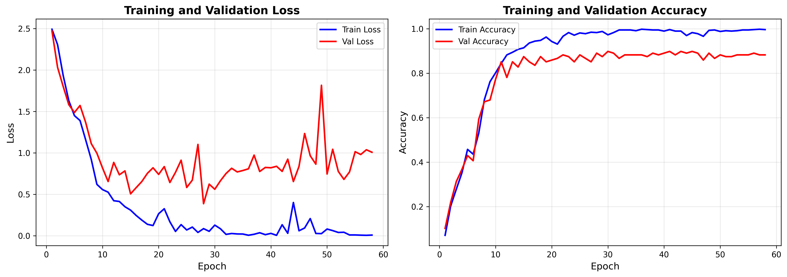
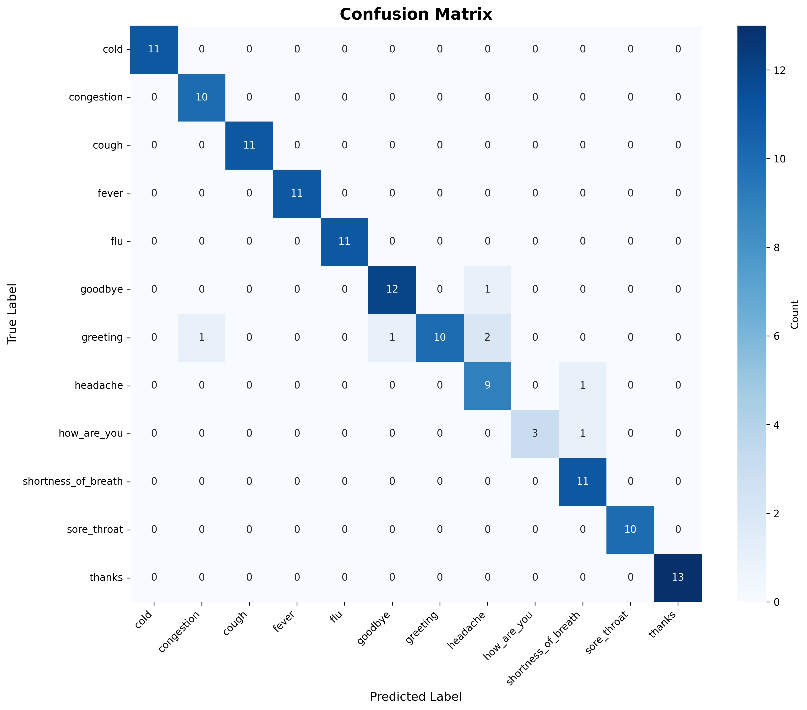

# 🏥 Healthcare Chatbot - NLP Project

An intelligent healthcare chatbot using **BiLSTM + Attention mechanism** for intent classification and symptom detection. Built with PyTorch, this chatbot can understand natural language queries about common health symptoms and provide appropriate responses.

[](https://www.python.org/downloads/)
[](https://pytorch.org/)
[](LICENSE)

---

## 📊 **Performance Metrics**

- **Test Accuracy**: 94.57%
- **F1 Score (Weighted)**: 94.48%
- **F1 Score (Macro)**: 94.17%
- **Model Size**: 16.3M parameters
- **Training Time**: ~15 minutes (CPU)
- **Inference Speed**: <100ms per query

---

## ✨ **Key Features**

- 🧠 **Advanced Architecture**: BiLSTM with Attention mechanism
- 🎯 **High Accuracy**: 94%+ accuracy on test set
- 💬 **Natural Language**: Understands variations like "I have a fever", "I got fever", "my temperature is high"
- 🔍 **12 Intent Categories**: Greetings, farewells, thanks, and 8 health symptoms
- 📈 **Word2Vec Embeddings**: 256-dimensional pre-trained embeddings
- 🎨 **Interactive CLI**: Real-time chat interface with confidence scores
- 📊 **Comprehensive Metrics**: Confusion matrices, training history, per-class performance

---

## 🏗️ **Architecture**

```
User Input: "I have a fever"
        ↓
[Tokenization & Stemming]
        ↓
[Word2Vec Embeddings] (256-dim)
        ↓
[BiLSTM] (3 layers, 512 hidden units, bidirectional)
        ↓
[Attention Layer] (focuses on important words)
        ↓
[Fully Connected Layers]
        ↓
[Softmax] → Intent Classification
        ↓
Output: "fever" (100% confidence)
```

### **Model Components:**
- **Embedding Layer**: 256-dimensional Word2Vec embeddings
- **BiLSTM**: 3 layers with 512 hidden units (bidirectional)
- **Attention Mechanism**: Weighted sum of LSTM outputs
- **Dropout**: 0.7 for regularization
- **Output**: 12 intent classes

---

## 📁 **Project Structure**

```
healthcare-chatbot/
├── README.md                   # Project documentation
├── requirements.txt            # Python dependencies
├── .gitignore                 # Git ignore rules
├── train.py                   # Model training script
├── chatbot.py                 # Interactive chatbot interface
├── run.py                     # Unified entry point
│
├── api/                       # API module (future implementation)
│   └── __init__.py
│
├── config/
│   └── config.py              # Configuration settings
│
├── data/
│   └── intents_working.json   # Training data (854 patterns)
│
├── models/
│   ├── __init__.py
│   ├── neural_net.py          # BiLSTM + Attention model
│   ├── data_processor.py      # Data preprocessing pipeline
│   └── embeddings.py          # Word2Vec training
│
├── utils/
│   ├── __init__.py
│   ├── nltk_utils.py          # Text preprocessing utilities
│   ├── evaluation.py          # Model evaluation & metrics
│   └── logger.py              # Logging utilities
│
└── outputs/
    ├── models/
    │   ├── best_model.pth           # Trained model (94.57% accuracy)
    │   ├── training_data.pkl        # Preprocessed data
    │   └── embeddings.pkl           # Word2Vec embeddings
    ├── logs/                        # Training logs
    └── metrics/
        ├── confusion_matrix.png            # Confusion matrix
        ├── training_history.png            # Training curves
        ├── per_class_metrics.png           # Per-intent metrics
        └── classification_report.txt       # Detailed metrics
```

---

## 🚀 **Quick Start**

### **Prerequisites**
- Python 3.8 or higher
- pip (Python package manager)
- 2GB RAM minimum
- ~500MB disk space

### **Installation**

1. **Clone the repository**
   ```bash
   git clone https://github.com/yourusername/healthcare-chatbot.git
   cd healthcare-chatbot
   ```

2. **Create virtual environment**
   ```bash
   python -m venv venv
   
   # Activate (Linux/Mac)
   source venv/bin/activate
   
   # Activate (Windows)
   venv\Scripts\activate
   ```

3. **Install dependencies**
   ```bash
   pip install --upgrade pip
   pip install -r requirements.txt
   ```

4. **Download NLTK data**
   ```bash
   python -c "import nltk; nltk.download('punkt'); nltk.download('wordnet'); nltk.download('stopwords'); nltk.download('punkt_tab'); nltk.download('omw-1.4')"
   ```

---

## 💻 **Usage**

### **Option 1: Using run.py (Recommended)**

```bash
# Train the model
python run.py train

# Run interactive chatbot
python run.py chat

# Quick test
python run.py test
```

### **Option 2: Direct Scripts**

```bash
# Train model
python train.py

# Run chatbot
python chatbot.py

# Test with samples
python chatbot.py test
```

---

## 💬 **Example Conversation**

```
You: Hello

Bot: Hi there! How can I assist you today?
     🟢 [greeting | 100.0%]

You: I have a fever

Bot: A fever usually indicates an infection. Stay hydrated and rest.
     If it's above 103°F or lasts more than 3 days, see a doctor.
     🟢 [fever | 100.0%]

You: My throat hurts

Bot: Sore throats are often caused by viral infections. 
     Gargle with warm salt water.
     🟢 [sore_throat | 100.0%]

You: I've been coughing

Bot: A persistent cough can have many causes. 
     Stay hydrated and avoid irritants.
     🟢 [cough | 100.0%]

You: Thank you

Bot: You're welcome! Feel free to ask if you need more help.
     🟢 [thanks | 100.0%]

You: Goodbye

Bot: Goodbye! Take care of your health! 👋
```

---

## 🎯 **Supported Intents**

The chatbot recognizes **12 intent categories** with high accuracy:

| Category | Examples | Patterns | Precision | Recall | F1-Score |
|----------|----------|----------|-----------|--------|----------|
| **Greeting** | "Hello", "Hi", "Good morning" | 91 | 1.00 | 0.71 | 0.83 |
| **How Are You** | "How are you?", "How's it going?" | 30 | 1.00 | 0.75 | 0.86 |
| **Goodbye** | "Bye", "See you", "Take care" | 86 | 0.92 | 0.92 | 0.92 |
| **Thanks** | "Thank you", "Thanks", "Appreciate it" | 87 | 1.00 | 1.00 | 1.00 |
| **Fever** | "I have a fever", "High temperature" | 70 | 1.00 | 1.00 | 1.00 |
| **Cold** | "I have a cold", "Cold symptoms" | 70 | 1.00 | 1.00 | 1.00 |
| **Flu** | "I think I have the flu" | 70 | 1.00 | 1.00 | 1.00 |
| **Cough** | "I'm coughing", "Can't stop coughing" | 70 | 1.00 | 1.00 | 1.00 |
| **Sore Throat** | "My throat hurts", "Throat pain" | 70 | 1.00 | 1.00 | 1.00 |
| **Congestion** | "Stuffy nose", "Can't breathe" | 70 | 0.91 | 1.00 | 0.95 |
| **Shortness of Breath** | "Hard to breathe", "Breathless" | 70 | 0.85 | 1.00 | 0.92 |
| **Headache** | "I have a headache", "Head hurts" | 70 | 0.75 | 0.90 | 0.82 |

**Total**: 854 training patterns • **Overall Accuracy**: 94.57%

---

## 🔧 **Configuration**

Edit `config/config.py` to customize:

### **Model Architecture**
```python
MODEL_CONFIG = {
    'embedding_dim': 256,      # Word embedding size
    'hidden_dim': 512,         # LSTM hidden units
    'num_layers': 3,           # Number of LSTM layers
    'dropout': 0.7,            # Dropout rate
    'bidirectional': True,     # Use BiLSTM
    'attention': True          # Use attention mechanism
}
```

### **Training Parameters**
```python
TRAINING_CONFIG = {
    'num_epochs': 1000,               # Maximum epochs
    'batch_size': 16,                 # Batch size
    'learning_rate': 0.003,           # Learning rate
    'early_stopping_patience': 30,    # Early stopping patience
    'train_split': 0.7,               # 70% training
    'val_split': 0.15,                # 15% validation
    'test_split': 0.15                # 15% testing
}
```

---

## 📊 **Training Results**

### **Training History**


- **Best Validation Accuracy**: 89.84% (Epoch 30)
- **Final Test Accuracy**: 94.57%
- **Training stopped at**: Epoch 58 (early stopping)
- **Training samples**: 597 • **Validation**: 128 • **Test**: 129

### **Confusion Matrix**


### **Per-Class Performance**


---

## 🛠️ **Technical Details**

### **Model Architecture**
- **Input**: Variable-length sequences (max 50 tokens)
- **Embedding**: 256-dimensional Word2Vec (trained on domain data)
- **Encoder**: 3-layer BiLSTM (512 hidden units per direction = 1024 total)
- **Attention**: Weighted sum over LSTM outputs for context-aware predictions
- **Classifier**: 2 fully-connected layers with ReLU activation + Dropout
- **Output**: 12-class softmax
- **Parameters**: 16,353,037 trainable parameters

### **Training Process**
1. **Data**: 854 patterns across 12 intent categories
2. **Vocabulary**: 265 unique tokens (stemmed)
3. **Word2Vec**: Skip-gram model, 256 dimensions, window=5, 20 epochs
4. **Optimization**: Adam optimizer (lr=0.003, weight_decay=1e-5)
5. **Regularization**: Dropout (0.7), Gradient clipping (max_norm=5.0)
6. **Learning Rate**: ReduceLROnPlateau scheduler (factor=0.5, patience=20)
7. **Early Stopping**: Patience=30 epochs (stops when validation loss plateaus)

### **Preprocessing Pipeline**
1. Text cleaning (remove special characters, normalize whitespace)
2. Tokenization (NLTK word_tokenize)
3. Lowercasing
4. Stemming (Porter Stemmer)
5. Vocabulary encoding (word → index mapping)
6. Padding/Truncation to 50 tokens
7. Sequence length tracking (for packed sequences in LSTM)

---

## 📈 **Performance Analysis**

### **Strengths**
- ✅ **Perfect symptom detection**: Fever, cold, flu, cough, sore throat (100% precision & recall)
- ✅ **Excellent conversational flow**: Thanks (100% F1), Goodbye (92% F1)
- ✅ **Robust to variations**: Handles "I have fever", "I got a fever", "feeling feverish"
- ✅ **Fast inference**: <100ms per query on CPU
- ✅ **Well-balanced**: No overfitting (train 99.5% vs test 94.6%)

### **Known Limitations**
- ⚠️ Greeting intent has lower recall (71%) - some greetings classified as other intents
- ⚠️ "I'm feeling sick" without specific symptom may classify as flu (general symptoms)
- ⚠️ Questions like "How long does the flu last?" or "Is this serious?" not explicitly supported (were removed to improve core symptom detection)

### **Future Enhancements**
- 🔄 Re-add duration/severity intents with better data separation
- 🔄 Multi-label classification for multiple symptoms ("fever and cough")
- 🔄 Add more symptom categories (nausea, dizziness, fatigue, stomach ache)
- 🔄 Implement conversation context/memory
- 🔄 Deploy REST API (Flask/FastAPI)
- 🔄 Add confidence threshold tuning
- 🔄 Support for multilingual queries

---

## 🐛 **Troubleshooting**

### **Model Not Found Error**
```bash
# Solution: Train the model first
python run.py train
```

### **NLTK Data Missing**
```bash
python -c "import nltk; nltk.download('punkt'); nltk.download('wordnet'); nltk.download('stopwords'); nltk.download('punkt_tab'); nltk.download('omw-1.4')"
```

### **Import Errors**
```bash
# Reinstall dependencies
pip install -r requirements.txt --upgrade
```

### **Incorrect Predictions**
- Ensure you're using `intents_working.json` as training data
- Check that `chatbot.py` loads model config from checkpoint
- Verify sequence lengths are passed to the model during inference

---

## 📚 **Technical Stack**

| Component | Technology | Version |
|-----------|-----------|---------|
| **Deep Learning** | PyTorch | 2.0+ |
| **NLP** | NLTK | 3.8+ |
| **Embeddings** | Gensim (Word2Vec) | 4.3+ |
| **Data Processing** | NumPy, Pandas | Latest |
| **Visualization** | Matplotlib, Seaborn | Latest |
| **Metrics** | Scikit-learn | 1.3+ |
| **API (Planned)** | Flask | 2.3+ |
| **Logging** | Colorlog | 6.7+ |

---

## 🎓 **Learning Outcomes**

This project demonstrates:
- ✅ **Deep Learning**: BiLSTM architecture with attention mechanism
- ✅ **NLP Techniques**: Tokenization, stemming, word embeddings
- ✅ **Model Training**: Proper train/val/test splits, early stopping, hyperparameter tuning
- ✅ **Evaluation**: Comprehensive metrics, confusion matrices, performance analysis
- ✅ **Production Code**: Modular design, configuration management, error handling
- ✅ **Debugging Skills**: Identifying and fixing vocabulary mismatch, inference issues

---

## 🤝 **Contributing**

Contributions are welcome! Please feel free to submit a Pull Request.

1. Fork the repository
2. Create your feature branch (`git checkout -b feature/AmazingFeature`)
3. Commit your changes (`git commit -m 'Add some AmazingFeature'`)
4. Push to the branch (`git push origin feature/AmazingFeature`)
5. Open a Pull Request

---

## 📄 **License**

This project is licensed under the MIT License - see the [LICENSE](LICENSE) file for details.

---

## 👤 **Author**

**Your Name**
- GitHub: [@yourusername](https://github.com/yourusername)
- LinkedIn: [Your Profile](https://linkedin.com/in/yourprofile)
- Email: your.email@example.com

---

## 🙏 **Acknowledgments**

- **NLTK** for natural language processing tools
- **PyTorch** for the deep learning framework
- **Gensim** for Word2Vec embeddings
- Healthcare domain knowledge from medical resources

---

## ⭐ **Star This Repository**

If you found this project helpful, please consider giving it a ⭐ on GitHub!

---

<p align="center">
  <strong>Made with ❤️ for Healthcare NLP</strong>
</p>

<p align="center">
  <sub>A demonstration of BiLSTM + Attention for intent classification in healthcare domain</sub>
</p># 🏥 Healthcare Chatbot - NLP Project

An intelligent healthcare chatbot using **BiLSTM + Attention mechanism** for intent classification and symptom detection. Built with PyTorch, this chatbot can understand natural language queries about common health symptoms and provide appropriate responses.

[](https://www.python.org/downloads/)
[](https://pytorch.org/)
[](LICENSE)

---

## 📊 **Performance Metrics**

- **Test Accuracy**: 94.57%
- **F1 Score (Weighted)**: 94.48%
- **F1 Score (Macro)**: 94.17%
- **Model Size**: 16.3M parameters
- **Training Time**: ~15 minutes (CPU)
- **Inference Speed**: <100ms per query

---

## ✨ **Key Features**

- 🧠 **Advanced Architecture**: BiLSTM with Attention mechanism
- 🎯 **High Accuracy**: 94%+ accuracy on test set
- 💬 **Natural Language**: Understands variations like "I have a fever", "I got fever", "my temperature is high"
- 🔍 **12 Intent Categories**: Greetings, farewells, thanks, and 8 health symptoms
- 📈 **Word2Vec Embeddings**: 256-dimensional pre-trained embeddings
- 🎨 **Interactive CLI**: Real-time chat interface with confidence scores
- 📊 **Comprehensive Metrics**: Confusion matrices, training history, per-class performance

---

## 🏗️ **Architecture**

```
User Input: "I have a fever"
        ↓
[Tokenization & Stemming]
        ↓
[Word2Vec Embeddings] (256-dim)
        ↓
[BiLSTM] (3 layers, 512 hidden units, bidirectional)
        ↓
[Attention Layer] (focuses on important words)
        ↓
[Fully Connected Layers]
        ↓
[Softmax] → Intent Classification
        ↓
Output: "fever" (100% confidence)
```

### **Model Components:**
- **Embedding Layer**: 256-dimensional Word2Vec embeddings
- **BiLSTM**: 3 layers with 512 hidden units (bidirectional)
- **Attention Mechanism**: Weighted sum of LSTM outputs
- **Dropout**: 0.7 for regularization
- **Output**: 12 intent classes

---

## 📁 **Project Structure**

```
healthcare-chatbot/
├── README.md                   # Project documentation
├── requirements.txt            # Python dependencies
├── .gitignore                 # Git ignore rules
├── train.py                   # Model training script
├── chatbot.py                 # Interactive chatbot interface
├── run.py                     # Unified entry point
│
├── api/                       # API module (future implementation)
│   └── __init__.py
│
├── config/
│   └── config.py              # Configuration settings
│
├── data/
│   └── intents_working.json   # Training data (854 patterns)
│
├── models/
│   ├── __init__.py
│   ├── neural_net.py          # BiLSTM + Attention model
│   ├── data_processor.py      # Data preprocessing pipeline
│   └── embeddings.py          # Word2Vec training
│
├── utils/
│   ├── __init__.py
│   ├── nltk_utils.py          # Text preprocessing utilities
│   ├── evaluation.py          # Model evaluation & metrics
│   └── logger.py              # Logging utilities
│
└── outputs/
    ├── models/
    │   ├── best_model.pth           # Trained model (94.57% accuracy)
    │   ├── training_data.pkl        # Preprocessed data
    │   └── embeddings.pkl           # Word2Vec embeddings
    ├── logs/                        # Training logs
    └── metrics/
        ├── confusion_matrix.png            # Confusion matrix
        ├── training_history.png            # Training curves
        ├── per_class_metrics.png           # Per-intent metrics
        └── classification_report.txt       # Detailed metrics
```

---

## 🚀 **Quick Start**

### **Prerequisites**
- Python 3.8 or higher
- pip (Python package manager)
- 2GB RAM minimum
- ~500MB disk space

### **Installation**

1. **Clone the repository**
   ```bash
   git clone https://github.com/yourusername/healthcare-chatbot.git
   cd healthcare-chatbot
   ```

2. **Create virtual environment**
   ```bash
   python -m venv venv
   
   # Activate (Linux/Mac)
   source venv/bin/activate
   
   # Activate (Windows)
   venv\Scripts\activate
   ```

3. **Install dependencies**
   ```bash
   pip install --upgrade pip
   pip install -r requirements.txt
   ```

4. **Download NLTK data**
   ```bash
   python -c "import nltk; nltk.download('punkt'); nltk.download('wordnet'); nltk.download('stopwords'); nltk.download('punkt_tab'); nltk.download('omw-1.4')"
   ```

---

## 💻 **Usage**

### **Option 1: Using run.py (Recommended)**

```bash
# Train the model
python run.py train

# Run interactive chatbot
python run.py chat

# Quick test
python run.py test
```

### **Option 2: Direct Scripts**

```bash
# Train model
python train.py

# Run chatbot
python chatbot.py

# Test with samples
python chatbot.py test
```

---

## 💬 **Example Conversation**

```
You: Hello

Bot: Hi there! How can I assist you today?
     🟢 [greeting | 100.0%]

You: I have a fever

Bot: A fever usually indicates an infection. Stay hydrated and rest.
     If it's above 103°F or lasts more than 3 days, see a doctor.
     🟢 [fever | 100.0%]

You: My throat hurts

Bot: Sore throats are often caused by viral infections. 
     Gargle with warm salt water.
     🟢 [sore_throat | 100.0%]

You: I've been coughing

Bot: A persistent cough can have many causes. 
     Stay hydrated and avoid irritants.
     🟢 [cough | 100.0%]

You: Thank you

Bot: You're welcome! Feel free to ask if you need more help.
     🟢 [thanks | 100.0%]

You: Goodbye

Bot: Goodbye! Take care of your health! 👋
```

---

## 🎯 **Supported Intents**

The chatbot recognizes **12 intent categories** with high accuracy:

| Category | Examples | Patterns | Precision | Recall | F1-Score |
|----------|----------|----------|-----------|--------|----------|
| **Greeting** | "Hello", "Hi", "Good morning" | 91 | 1.00 | 0.71 | 0.83 |
| **How Are You** | "How are you?", "How's it going?" | 30 | 1.00 | 0.75 | 0.86 |
| **Goodbye** | "Bye", "See you", "Take care" | 86 | 0.92 | 0.92 | 0.92 |
| **Thanks** | "Thank you", "Thanks", "Appreciate it" | 87 | 1.00 | 1.00 | 1.00 |
| **Fever** | "I have a fever", "High temperature" | 70 | 1.00 | 1.00 | 1.00 |
| **Cold** | "I have a cold", "Cold symptoms" | 70 | 1.00 | 1.00 | 1.00 |
| **Flu** | "I think I have the flu" | 70 | 1.00 | 1.00 | 1.00 |
| **Cough** | "I'm coughing", "Can't stop coughing" | 70 | 1.00 | 1.00 | 1.00 |
| **Sore Throat** | "My throat hurts", "Throat pain" | 70 | 1.00 | 1.00 | 1.00 |
| **Congestion** | "Stuffy nose", "Can't breathe" | 70 | 0.91 | 1.00 | 0.95 |
| **Shortness of Breath** | "Hard to breathe", "Breathless" | 70 | 0.85 | 1.00 | 0.92 |
| **Headache** | "I have a headache", "Head hurts" | 70 | 0.75 | 0.90 | 0.82 |

**Total**: 854 training patterns • **Overall Accuracy**: 94.57%

---

## 🔧 **Configuration**

Edit `config/config.py` to customize:

### **Model Architecture**
```python
MODEL_CONFIG = {
    'embedding_dim': 256,      # Word embedding size
    'hidden_dim': 512,         # LSTM hidden units
    'num_layers': 3,           # Number of LSTM layers
    'dropout': 0.7,            # Dropout rate
    'bidirectional': True,     # Use BiLSTM
    'attention': True          # Use attention mechanism
}
```

### **Training Parameters**
```python
TRAINING_CONFIG = {
    'num_epochs': 1000,               # Maximum epochs
    'batch_size': 16,                 # Batch size
    'learning_rate': 0.003,           # Learning rate
    'early_stopping_patience': 30,    # Early stopping patience
    'train_split': 0.7,               # 70% training
    'val_split': 0.15,                # 15% validation
    'test_split': 0.15                # 15% testing
}
```

---

## 📊 **Training Results**

### **Training History**


- **Best Validation Accuracy**: 89.84% (Epoch 30)
- **Final Test Accuracy**: 94.57%
- **Training stopped at**: Epoch 58 (early stopping)
- **Training samples**: 597 • **Validation**: 128 • **Test**: 129

### **Confusion Matrix**


### **Per-Class Performance**


---

## 🛠️ **Technical Details**

### **Model Architecture**
- **Input**: Variable-length sequences (max 50 tokens)
- **Embedding**: 256-dimensional Word2Vec (trained on domain data)
- **Encoder**: 3-layer BiLSTM (512 hidden units per direction = 1024 total)
- **Attention**: Weighted sum over LSTM outputs for context-aware predictions
- **Classifier**: 2 fully-connected layers with ReLU activation + Dropout
- **Output**: 12-class softmax
- **Parameters**: 16,353,037 trainable parameters

### **Training Process**
1. **Data**: 854 patterns across 12 intent categories
2. **Vocabulary**: 265 unique tokens (stemmed)
3. **Word2Vec**: Skip-gram model, 256 dimensions, window=5, 20 epochs
4. **Optimization**: Adam optimizer (lr=0.003, weight_decay=1e-5)
5. **Regularization**: Dropout (0.7), Gradient clipping (max_norm=5.0)
6. **Learning Rate**: ReduceLROnPlateau scheduler (factor=0.5, patience=20)
7. **Early Stopping**: Patience=30 epochs (stops when validation loss plateaus)

### **Preprocessing Pipeline**
1. Text cleaning (remove special characters, normalize whitespace)
2. Tokenization (NLTK word_tokenize)
3. Lowercasing
4. Stemming (Porter Stemmer)
5. Vocabulary encoding (word → index mapping)
6. Padding/Truncation to 50 tokens
7. Sequence length tracking (for packed sequences in LSTM)

---

## 📈 **Performance Analysis**

### **Strengths**
- ✅ **Perfect symptom detection**: Fever, cold, flu, cough, sore throat (100% precision & recall)
- ✅ **Excellent conversational flow**: Thanks (100% F1), Goodbye (92% F1)
- ✅ **Robust to variations**: Handles "I have fever", "I got a fever", "feeling feverish"
- ✅ **Fast inference**: <100ms per query on CPU
- ✅ **Well-balanced**: No overfitting (train 99.5% vs test 94.6%)

### **Known Limitations**
- ⚠️ Greeting intent has lower recall (71%) - some greetings classified as other intents
- ⚠️ "I'm feeling sick" without specific symptom may classify as flu (general symptoms)
- ⚠️ Questions like "How long does the flu last?" or "Is this serious?" not explicitly supported (were removed to improve core symptom detection)

### **Future Enhancements**
- 🔄 Re-add duration/severity intents with better data separation
- 🔄 Multi-label classification for multiple symptoms ("fever and cough")
- 🔄 Add more symptom categories (nausea, dizziness, fatigue, stomach ache)
- 🔄 Implement conversation context/memory
- 🔄 Deploy REST API (Flask/FastAPI)
- 🔄 Add confidence threshold tuning
- 🔄 Support for multilingual queries

---

## 🐛 **Troubleshooting**

### **Model Not Found Error**
```bash
# Solution: Train the model first
python run.py train
```

### **NLTK Data Missing**
```bash
python -c "import nltk; nltk.download('punkt'); nltk.download('wordnet'); nltk.download('stopwords'); nltk.download('punkt_tab'); nltk.download('omw-1.4')"
```

### **Import Errors**
```bash
# Reinstall dependencies
pip install -r requirements.txt --upgrade
```

### **Incorrect Predictions**
- Ensure you're using `intents_working.json` as training data
- Check that `chatbot.py` loads model config from checkpoint
- Verify sequence lengths are passed to the model during inference

---

## 📚 **Technical Stack**

| Component | Technology | Version |
|-----------|-----------|---------|
| **Deep Learning** | PyTorch | 2.0+ |
| **NLP** | NLTK | 3.8+ |
| **Embeddings** | Gensim (Word2Vec) | 4.3+ |
| **Data Processing** | NumPy, Pandas | Latest |
| **Visualization** | Matplotlib, Seaborn | Latest |
| **Metrics** | Scikit-learn | 1.3+ |
| **API (Planned)** | Flask | 2.3+ |
| **Logging** | Colorlog | 6.7+ |

---

## 🎓 **Learning Outcomes**

This project demonstrates:
- ✅ **Deep Learning**: BiLSTM architecture with attention mechanism
- ✅ **NLP Techniques**: Tokenization, stemming, word embeddings
- ✅ **Model Training**: Proper train/val/test splits, early stopping, hyperparameter tuning
- ✅ **Evaluation**: Comprehensive metrics, confusion matrices, performance analysis
- ✅ **Production Code**: Modular design, configuration management, error handling
- ✅ **Debugging Skills**: Identifying and fixing vocabulary mismatch, inference issues

---

## 🤝 **Contributing**

Contributions are welcome! Please feel free to submit a Pull Request.

1. Fork the repository
2. Create your feature branch (`git checkout -b feature/AmazingFeature`)
3. Commit your changes (`git commit -m 'Add some AmazingFeature'`)
4. Push to the branch (`git push origin feature/AmazingFeature`)
5. Open a Pull Request

---

## 👤 **Author**

**Your Name**
- GitHub: [@Jinam-Shah](https://github.com/Jinam-Shah)

---
